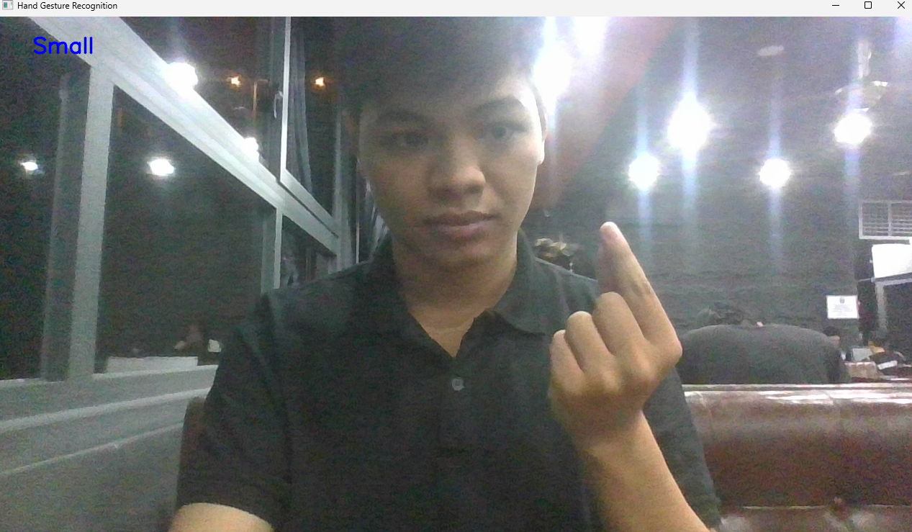

# Simple Hand Gesture Recognition
Develop a real-time hand gesture recognition program based on hand keypoints of mediapipe.

## Project structure
* [checkpoints](checkpoints)                    : trained weights, includes best training epoch and last traing epoch's checkpoint. Each checkpoint includes model structure, optimizer state dict and model state dict.
* [data](data)      : videos and npy for storing extracted keypoint information
* [models](models)      : model structures.
* [scripts](scripts)      : extracting hand points, training scripts and testing scripts.
* [utils](utils)      : helper functions.


## Execute
To train, evaluate models as well as run the program, you have to manually tune parameters from the source code.


Extract keypoints:
```
python scripts/hand_key_points.py
```
Training:
```
python train_model.py
```
Run the model with real-time camera:
```
python scripts/test_model.py
```
Example:

## Author
Dang Khoi.